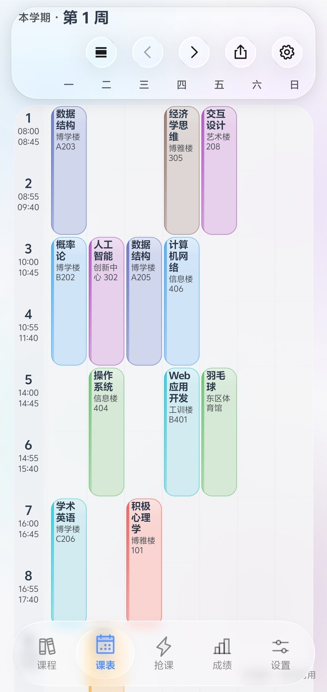
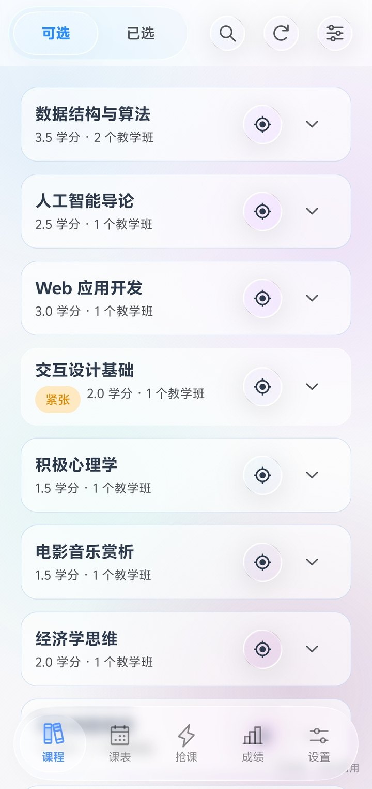
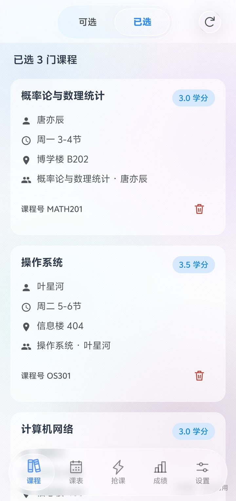
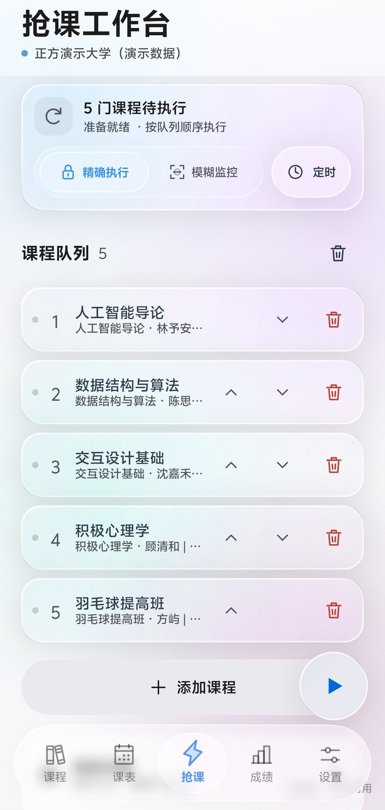
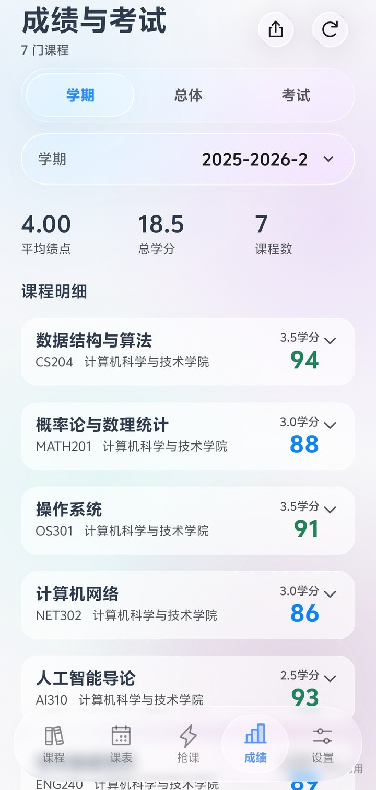
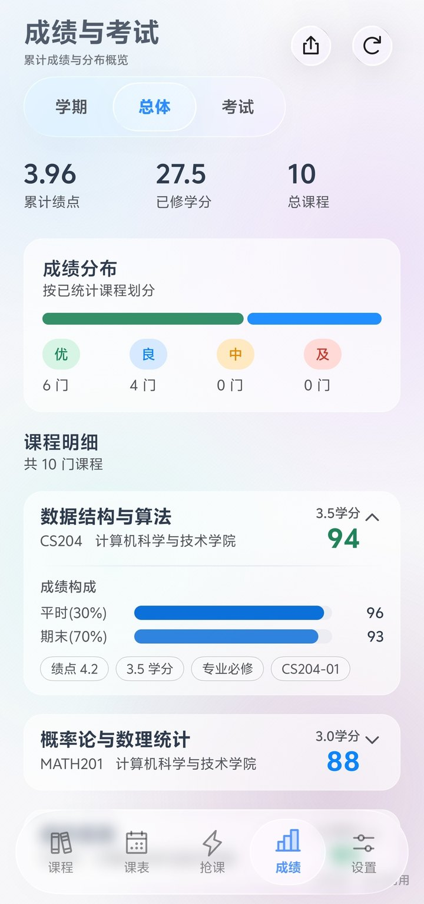
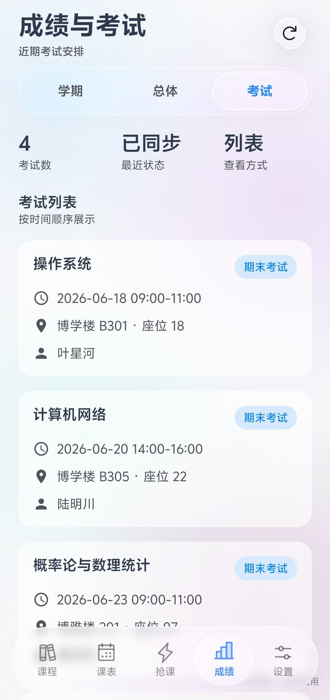
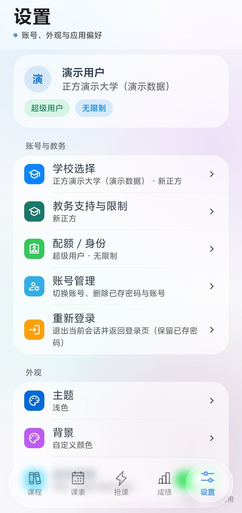

# 卡皮巴拉教务助手 · 项目介绍

> 一只情绪稳定的卡皮巴拉，替你盯着余量。选课抢课、课表成绩，全都在一个 App 里。

本仓库是 [教务助手](https://github.com/znjhahaha/zhengfang-apk) 的二次开发版（GPL-3.0 衍生作品），
在保留上游全部教务适配能力的基础上，做了品牌替换、上游服务解耦与若干界面／功能迭代。
原始版权归原作者及其贡献者所有。

| 项 | 值 |
|---|---|
| 当前版本 | **v1.1.5**（versionCode 16） |
| 安装包 | [app-release.apk](https://gitee.com/sonder123i/capybara-course-helper/releases/download/v1.1.5/app-release.apk) · 6.12 MB（Gitee 国内直连）· [GitHub 备用](https://github.com/sonder123i/capybara-course-helper/releases/latest) |
| 官网 | https://sonder123i.github.io/capybara-course-helper/ |
| 仓库 | https://github.com/sonder123i/capybara-course-helper |
| 代码镜像 | https://gitee.com/sonder123i/capybara-course-helper |
| 包名 | `com.k2767.course` |
| 系统要求 | Android 7.0+（minSdk 24），建议 12 以上，玻璃效果最全 |
| 许可 | GPL-3.0 |

---

## 一、它解决什么问题

学校的教务系统只给你一个网页：选课要盯着余量刷新，课表是一张糊掉的表格，成绩查完还得自己算 GPA。
这个 App 把这些搬到手机上，并且把「抢课」当成一件正经事来做——可以定时、可以捡漏、可以按条件自动匹配。

离线优先：课表、成绩、已选课程都会缓存到本机，没网也能翻。

---

## 二、能做什么

### 2.1 选课与抢课

| 模式 | 适用场景 | 说明 |
|---|---|---|
| 即时执行 | 现在就有空位 | 拼手速，点一下直接提交 |
| 定时任务 | 知道几点开抢 | 先把课加进队列 → 设启动时间 → 到点自动发包 |
| 捡漏 | 想抢已经满员的热门课 | 盯着名额，有人退立刻顶上 |

其余能力：按关键词搜、按类别筛，余量与教师都显示；支持批量选课／退课、队列排序、精确目标（指定教师与时段）、
智能匹配（同轮次同课程内换教师或时段）；队列按账号保护轮次与表单状态，带轮次等待、网络退避与停止条件。
未知容量如实显示「未公布」，不会当成有空位。

抢课使用前台服务，定时启动使用 AlarmManager。通知、精确闹钟权限与系统后台限制会影响运行与触发时间，
学校仍决定选课窗口、名额、学分与冲突规则。

### 2.2 课表

- **周视图 + 日视图**，顶部一键切换，切换带两拍式动画（旧视图收起淡出 → 新视图展开淡入，全程不空屏）
- 一屏可容纳全部 8 节；地点完整显示，长地点折行不截断
- 课程自动配色；支持添加自定义课程，冲突时给出非阻断提示，删除可 5 秒撤销
- 按周过滤单双周；周次跟随当前学期日历
- 导出 `.ics` 到系统日历
- 课前 15 分钟提醒（默认关闭，按账号／学期／课程隔离）

### 2.3 成绩与考试

- 按学期查询，也支持总体成绩
- GPA 自动计算，学校返回的成绩分项与统计如实展示
- 考试安排独立查看，支持 CSV 导出

### 2.4 桌面小组件（v1.1.0 起）

三个小组件，用 Glance 实现，**不依赖应用常驻后台**——组件自己按日期与周次算「今天上什么」：

| 组件 | 内容 |
|---|---|
| 今日课程 | 课名、地点、时间与配色条；小屏显示下一节，大屏最多六节 |
| 今日与明日 | 两栏并排，提前知道明天带不带书 |
| 今日时间轴 | 从今天起几天的课按上课时刻排成一列，正在上的一节高亮，可滚动 |

细节：教室与时间各占一行（校区前缀自动裁掉）；上完的课自动让位给后面的课，
下课那一刻组件自动刷新，全上完显示「今天的课都上完啦」；点击组件打开课表。
演示模式下也能用（按本周计算周次），退出演示模式会自动清掉桌面上的演示课。

### 2.5 学校库与登录

- 内置 **1777 所高校**，选择学校是全屏学校库：中文／拼音／首字母搜索 + A-Z 索引 + 收藏
- 学校类型自动识别，暂未适配的学校如实标注
- 登录方式：账号密码（需验证码时按提示输入或刷新图片验证码）、网页登录、统一身份认证
- 已适配定制 SSO 的学校可直接账密登录；不支持的走网页登录入口

### 2.6 外观

- **液态玻璃**：折射、色散、镜面高光实时计算，按压会形变，松手弹回；低端设备自动降级到透镜采样，不会卡死
- **背景可换**：预设渐变、纯色，或直接选相册里的图；图片背景可调模糊与暗沉两根滑条
- **配色跟着背景走**：按壁纸对应区域的亮度自动决定深浅，带迟滞阈值防抖动
- 跟随系统／浅色／深色三态主题；液态玻璃可整体关闭
- 顶栏随滚动收起，筛选面板改为浮层（列表不跳回顶部）
- 底栏图标为线面分层设计，选中播放一次；圆形抢课入口支持长按展开扇形菜单、滑动选择、松手执行

### 2.7 账号与安全

- 密码经 **Android KeyStore 的 AES/GCM** 加密后仅保存在本机，登录时提交到所选学校的教务地址
- 会话过期会尝试静默续期；学校要求验证码或二次确认时需人工完成
- 加密或读取失败一律按「未保存凭据」处理，不会明文写盘
- 最多可绑定 **3 个学生账号**（所有学校合计，纯本地计数）

---

## 三、支持的教务系统

| 教务 | 登录 | 执行与数据限制 |
|---|---|---|
| 新正方 | 账密、图片验证码、网页登录 | 串行或最多 2 门并行；筛选与查询以学校返回内容为准 |
| 旧正方 | 标准 RSA 账密登录、图片验证码获取与刷新 | 按账号串行保护表单状态；体育课与选退课使用学校当前控件 |
| 新强智 | 直接账密登录；额外人机验证可转网页登录 | 按账号串行保护轮次上下文；无开放轮次时仍可查询已选、课表与成绩 |
| 旧强智 | 账密登录、图片验证码获取与刷新 | 按账号串行保护轮次上下文；开放分类及操作权限由学校决定 |

四类教务共用单门／批量选课、退课、队列排序、精确目标、智能匹配与定时任务入口，以及课表、成绩、考试和导出功能。

验证码、选课声明、结果待确认或登录失效时需要人工处理，**应用不会绕过学校限制**。
实网账密登录及查询已验证山东农业大学（新强智）、广州松田职业学院（旧强智）、黑龙江工程学院（旧正方），验证过程未提交真实选课或退课。

---

## 四、界面

<table>
  <tr>
    <td align="center"><br/><sub>周视图课表</sub></td>
    <td align="center"><br/><sub>课程 · 可选</sub></td>
    <td align="center"><br/><sub>课程 · 已选</sub></td>
    <td align="center"><br/><sub>抢课工作台</sub></td>
  </tr>
  <tr>
    <td align="center"><br/><sub>成绩 · 按学期</sub></td>
    <td align="center"><br/><sub>成绩 · 总体与分布</sub></td>
    <td align="center"><br/><sub>考试安排</sub></td>
    <td align="center"><br/><sub>设置</sub></td>
  </tr>
</table>

> 实机截图，跑的是内置演示数据（正方演示大学），浅色主题。桌面小组件的实拍见 `pic/v1.1.2/09-widgets-dark.jpg`。

---

## 五、怎么装

1. **下载 APK**：从 [Releases](https://github.com/sonder123i/capybara-course-helper/releases/latest) 或[官网](https://sonder123i.github.io/capybara-course-helper/)下载 `app-release.apk`
2. **允许安装未知来源应用**：系统会弹提示，按引导开启对应权限
3. **添加学校并登录**：在 1777 所学校里搜到你的学校，确认教务类型，填写账号密码

注意事项：

- 包名与原版 `com.tyust.course` 不同，两者可以共存，但学校配置与账密需要重新登录一遍
- 应用内更新已指向本项目自己的 `version.json`，装一次之后可以自己检测新版
- 若之前装过同包名的 **debug 版**，需先卸载才能安装 release 版（签名不同无法覆盖）

---

## 六、从源码构建

环境要求：Android Studio Hedgehog+、**JDK 17**、Android SDK（`compileSdk 37` / `targetSdk 34` / `minSdk 24`）。

```bash
git clone https://github.com/sonder123i/capybara-course-helper.git
cd capybara-course-helper
./gradlew assembleDebug
```

Debug 包约 29.7 MB；Release 包约 6.1 MB（`minifyEnabled true`，走 R8）。

构建 Release 需要自己的签名，在项目根目录 `local.properties` 中配置（或用同名环境变量）：

```properties
RELEASE_STORE_PASSWORD=你的 keystore 密码
RELEASE_KEY_ALIAS=你的 alias
RELEASE_KEY_PASSWORD=你的 key 密码
```

keystore 默认放在 `app/release-key.jks`，也可以用环境变量 `RELEASE_SIGNING_CONFIG_FILE` 指向别处。
`release-key.jks`、`local.properties`、`proguard-rules.pro` 均已在 `.gitignore` 中排除。

技术栈：Kotlin + Jetpack Compose（Material 3）；玻璃渲染用 Kyant Backdrop 2.0，`blur + lens + vibrancy` 三层按设备能力分档；
桌面小组件用 Glance；动效曲线集中在 `MotionTokens`；网络 OkHttp + Coroutines，HTML 用 Jsoup 解析；
屏幕适配靠 `ScreenMetrics` 的两个连续紧凑度系数插值几何，不做尺寸分档。

---

## 七、与上游的关系

本仓库 fork 自 [znjhahaha/zhengfang-apk](https://github.com/znjhahaha/zhengfang-apk)，基线为其 **v1.0.80**，继续以 GPL-3.0 发布。改动如下：

| 类别 | 内容 |
|---|---|
| 品牌 | 应用名改为「卡皮巴拉教务助手」；应用图标、启动页图形替换为卡皮巴拉；设置页「关于作者」改为「关于项目」 |
| 包名 | `applicationId` 与源码包名（`namespace`）由 `com.tyust.course` 改为 `com.k2767.course`，共替换 360 个文件、1832 处 |
| 服务解耦 | 新增 `SelfHostConfig.kt` 集中开关，切断对上游自建服务的依赖；应用内更新改指向本仓库 |
| 仓库清理 | 移除上游的统计服务端、发布脚本、CI 工作流、issue 模板与编辑器遗留文件 |
| 构建 | 补齐 `local.properties`；Gradle 发行包改用国内镜像获取 |

**未改动**：四类教务系统的适配逻辑、抢课与捡漏实现、课表与成绩的数据处理、液态玻璃渲染管线——这些能力沿用上游实现。

按 GPL-3.0 的三条核心义务：保留原作者版权声明与本许可、衍生作品继续以 GPL-3.0 发布、
分发时提供完整对应源码并显著标注修改（即本文档与 `README.md`、`LICENSE` 中的说明）。

> 上游原作者的表述是「不接受任何形式的私自打包和分发，唯一的二开渠道是向本仓库提 PR」。
> 该表述与 GPL-3.0 第 10 条（不得对所授予的权利附加进一步限制）存在冲突。
> 作为遵循 GPL-3.0 的衍生作品，本 fork 按 GPL-3.0 的条款发布与分发。

---

## 八、自用改造开关

上游把应用内更新、公告、用户反馈、匿名统计、学校适配申请等能力托管在作者自己的服务上。
本 fork 新增 `app/src/main/java/com/k2767/course/SelfHostConfig.kt`，把这些通道集中管理——
每个开关只控制「要不要发这个请求」，**不改动任何业务逻辑本身**。当前取值：

| 开关 | 当前 | 作用 |
|---|---|---|
| `ENABLE_APP_UPDATE_CHECK` | 开 | 更新检查，指向本项目的 `version.json` |
| `ENABLE_REMOTE_ANNOUNCEMENT` | 关 | 远端公告拉取，关闭后公告列表恒为空 |
| `ENABLE_REMOTE_FEEDBACK` | 关 | 用户反馈上报，关闭后反馈内容不离开本机 |
| `ENABLE_ANONYMOUS_USAGE_STATS` | 关 | 匿名使用统计上报 |
| `ENABLE_USAGE_STATS_UI` | 关 | 统计相关的知情弹窗与设置页开关 |
| `ENABLE_SCHOOL_SERVICE_BACKEND` | 关 | 学校适配申请与问卷中心后端 |
| `ENABLE_SCHOOL_ADAPTATION_UI` | 关 | 「统一登录适配」入口（内置学校库已覆盖绝大多数学校） |
| `SHOW_BUILT_IN_SCHOOLS` | 关 | 上游预置的三所默认学校（隐藏而非删除，已保存的选择不会失效） |

想把某一项恢复成上游行为，改回 `true` 即可。

---

## 九、数据与隐私

**本应用不采集、不上传任何使用数据。** 上游版本会采集随机安装标识与应用版本并上报到作者自建服务，
本 fork 已在装配层关闭该通道（`SelfHostConfig.ENABLE_ANONYMOUS_USAGE_STATS`），
`UsageReporter` 的通用逻辑与其单元测试都保持原样，不会有任何统计请求发出。

本机数据：

- 学校配置、课表、成绩缓存、抢课队列：保存在应用私有目录
- 账号密码：Android KeyStore AES/GCM 加密，仅本机
- 「所有学校合计最多 3 个学生账号」的计数：纯本地记录
- 应用卸载后上述数据一并清除

---

## 十、版本演进

| 版本 | 主题 |
|---|---|
| v1.0.0 | 首个自用版：品牌层改造、切断上游自建服务、自建更新通道（GitHub Pages）上线 |
| v1.0.1 – v1.0.6 | 痕迹清理与迭代：源码包名重命名、启动页图形、关于页、仓库卫生（详见 `自用改造清单.md`） |
| v1.0.7 | 内置学校库，1777 所高校，搜索 + A-Z 索引 + 收藏 |
| v1.0.8 | 日／周视图切换动画（两拍式） |
| v1.0.9 | 默认首屏改为课表；隐藏统一登录适配入口；更新历史改为本项目记录 |
| v1.1.0 | 新增桌面小组件「今日课程」 |
| v1.1.1 | 小组件完善：「今日与明日」双栏 + 「周课表」网格；修复组件容量与下载进度卡 0% |
| v1.1.2 | 小组件体验：教室／时间分行、下课让位、演示模式支持 |
| v1.1.3 | 周课表组件按真实高度排满（拉高不再留白）；修复应用内更新下载被误判为失败；演示模式的组件周次兜底 |
| v1.1.4 | 换上新头像（桌面图标／启动页／官网同步）；小组件在组件选择面板里显示自己的样子 |
| v1.1.5 | 周视图日期修复（大字体下曾被行高压成不显示）；没设开学日期时的弹窗与常驻提示；设置页「现在是第几周」反推 |

每个已发布版本的更新说明见 [Releases](https://github.com/sonder123i/capybara-course-helper/releases)，
用户端可通过「设置 → 更新历史」查看。

---

## 十一、免责声明与许可

- 项目开源免费，仅供学习交流
- 用出任何后果自己负责
- 抢课归抢课，别挂一晚上把学校教务打挂
- 应用不会绕过学校限制，验证码、人工确认等环节仍需你本人处理

本项目以 [GPL-3.0](LICENSE) 发布。原始版权归 [@znjhahaha](https://github.com/znjhahaha) 及其贡献者所有。
